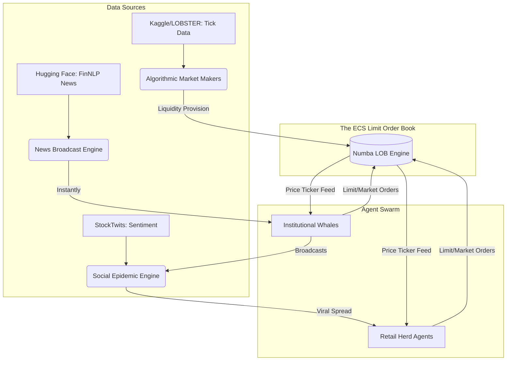
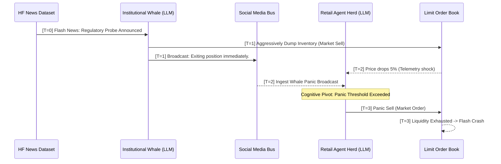

# Simulation Concept & Design Specification

The Agentic Market Panic Simulator (AMPS) is designed to empirically investigate the emergence of flash crashes, algorithmic herding, and liquidity cascades driven by autonomous, LLM-powered trading agents acting within a mathematically rigid Limit Order Book (LOB) environment.

## 1. Scale of the Simulated Market

To balance high-fidelity social/cognitive modeling with hardware constraints (128GB RAM consumer server), the market operates under the following scale constraints:

* **The Heterogeneous Agent Swarm:**
    * **The Macro-Orchestrator (God Agent):** A quantized 70B LLM pinned exclusively to the 128GB Host CPU RAM (E-Cores). It generates asynchronous macroeconomic shocks and global news events but does *not* simulate individual traders.
    * **The Micro-Agent Swarm (Retail/Whales):** 400 fully autonomous, stateful LLM instances driven by a highly quantized 27B model (e.g., 1.58-bit ternary) loaded entirely into the 16GB RTX 5070 Ti VRAM. This strict division prevents catastrophic KV-cache memory exhaustion.
    * **Algorithmic Agents (Non-LLM):** 1,000 deterministic actors (Market Makers, Momentum strats, Noise traders) managed by the Numba JIT engine to provide baseline liquidity without consuming LLM inference cycles.
* **Asset Universe (Tickers):** 10 highly correlated equities (e.g., modeling a concentrated tech sector) and 1 highly leveraged derivative asset. This cross-asset correlation is critical for inducing portfolio-level contagion.
* **Temporal Resolution (Tick Rates):**
    * **LOB Matching Engine:** Operates at 1,000 Ticks Per Second (TPS).
    * **Agent Cognitive Loop:** Evaluated asynchronously; agents poll the market and update their semantic intent roughly every 2-10 seconds, depending on the dynamic throttling and batching constraints of the inference server.

## 2. Dataset Derivation & Environmental Inputs

The simulation requires immense, high-quality empirical data to ground the agents' cognitive reasoning. We pipeline these from standard ML hubs:

* **Market Microstructure & Order Books:** Historical tick-level LOB data sourced from academic datasets (e.g., LOBSTER) or Kaggle (e.g., Optiver Realized Volatility challenge) to bootstrap the algorithmic market makers and pre-fill the order books before the LLMs engage.
* **News & Macroeconomic Shocks:** Hugging Face datasets (e.g., `FinNLP`, `philschmid/fin-news-dataset`) to stream synchronized, historically realistic news headlines and earnings reports.
* **Social Sentiment & Rumors:** Kaggle Twitter/StockTwits financial datasets. These form the "noise" layer, triggering emotional or FOMO-driven responses in retail agents.
* **Fundamentals:** SEC 10-K/10-Q filings (e.g., HF: `eloukas/edgar-corpus`) injected into the semantic cache of institutional agents for fundamental value anchoring.

## 3. Network Topologies & Agent Interactions

AMPS does not treat agents as isolated islands. Panic is a social phenomenon, driven by network effects and information asymmetry.

### A. The Financial Interaction Network (The Engine)

Agents interact financially strictly through the Limit Order Book via:

* **Maker/Taker Limit Orders:** Bids and Asks placed at specific price levels.
* **Market Orders:** Aggressive liquidity sweeping.
* **Margin Calls:** Forced liquidation cascades executed by the central clearing authority when an agent's portfolio VaR exceeds limits.

### B. The Social & Information Graph

Information is distributed across a scale-free directed graph, modeling the real-world asymmetry of financial markets:

* **News Nodes (Bloomberg/Reuters proxies):** Institutional agents subscribe directly to these nodes, receiving raw datasets instantly.
* **Influencer Nodes (Whales/FinTwit):** Agents with massive following. When they act or broadcast a synthetic "tweet", the signal propagates outward.
* **Retail Herd Nodes:** Agents clustered tightly with high intra-cluster connectivity. They suffer from latency (receiving news T+3 ticks later) and heavily weight the sentiment of Influencer Nodes over fundamental data.

---

## 4. Architectural Diagrams

### 4.1 Macro Topology of the Simulation

### 4.2 Information Propagation (Social Epidemic Model)

Panic spreads via a modified Susceptible-Infected-Recovered (SIR) network model embedded in the agents' semantic context:

